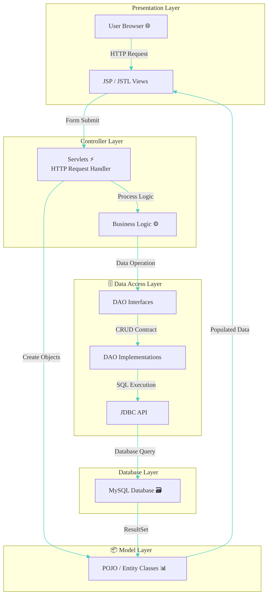

# 🍔 FoodXpress – Full-Stack Food Delivery Web Application

A **production-style food order web application** built using **Java EE, JSP, Servlets, JDBC, and MySQL**, following the **MVC (Model–View–Controller) architecture**.
**FoodXpress** simulates a real-world online food ordering platform where users can **discover restaurants 🍽️, explore menus 📋, manage carts 🛒, place orders 🚀, and track order history 📦** — similar to popular platforms like **Swiggy** and **Zomato**.

<p align="center">
  
</p>

---
## ✨ Elevator Pitch

**FoodXpress** is a full-stack **food delivery web application** designed to digitize the traditional restaurant ordering experience using **core Java EE technologies**.

- The platform enables users to **register and log in securely 🔐**
- Browse restaurants 🍽️
- Explore dynamic menus 📋
- Add items to a persistent cart 🛒
- Place orders 🚀
- Track their complete order history 📦 through a clean, user-friendly interface

- Built using a **layered MVC architecture**
- FoodXpress demonstrates real-world backend engineering practices such as:
  - **Servlet-based request handling**
  - **DAO abstraction**
  - **JDBC-driven database interaction**
  - **Session management**
  - **Secure authentication**
- Making it a strong showcase of **end-to-end Java full-stack development**

---
## 📸 Demo & Screenshots

Below is a visual walkthrough of **FoodXpress**, showcasing key user flows and core features of the application — from authentication to order completion 📦🚀

### 🏠 User Journey Screens

<p align="center">
  
  
</p>

<p align="center">
  
  
</p>

---

### 🍽️ Browsing & Ordering Flow

<p align="center">
  
  
</p>

<p align="center">
  
  
</p>

---

### ✅ Order Completion & History

<p align="center">
  
  
</p>

---
## 🎯 Key Features

### 👤 User Features
- 🔐 Secure **User Registration & Login** with session management
- 🏠 Personalized **User Dashboard** after authentication
- 🍽️ Browse available **Restaurants** with detailed listings
- 📋 View **Dynamic Menus** with real-time item data
- 🛒 **Add to Cart** functionality with quantity management
- 📍 Manage **Delivery Addresses** for order placement
- 🚀 Smooth **Checkout Flow** with order confirmation
- 📦 View **Order Success** and detailed **Order History**
- 👤 Update and manage **User Profile** information

### 🛠️ System & Backend Features
- 🧱 Clean **MVC (Model–View–Controller)** architecture
- 🔄 **Servlet-based request handling** and routing
- 🗄️ **DAO pattern** for database abstraction
- 🔌 **JDBC integration** with MySQL for persistent storage
- 🔐 **Session tracking** for authenticated user flows
- ⚠️ Centralized **validation & error handling**
- 🧹 Modular and maintainable **project structure**

### 💻 Frontend & UX Features
- 🎨 Clean, intuitive, and user-friendly UI
- 📱 Responsive layouts for different screen sizes
- ⚡ Dynamic page rendering using **JSP**
- 🧭 Simple navigation flow across all modules
- ✅ Clear user feedback for actions and status updates

---
## 🛠️ Technology Stack

| Tool / Technology | Badge | Description |
|-------------------|-------|-------------|
| **Java (JDK 17)** |  | Core backend language used for business logic, servlets, DAO layers, and application flow |
| **JSP** | -007396?style=for-the-badge&logo=java&logoColor=white) | View layer technology for rendering dynamic web pages |
| **Servlets** |  | Controller layer handling HTTP requests, responses, and routing |
| **JDBC** |  | Java API used for database connectivity and SQL execution |
| **MySQL** |  | Relational database for storing users, restaurants, menus, carts, and orders |
| **HTML5** |  | Markup language for structuring web pages |
| **CSS3** |  | Styling and layout design for responsive UI |
| **JavaScript** |  | Client-side interactions and UI behavior |
| **Apache Tomcat 9** |  | Servlet container used to deploy and run the application |
| **Eclipse IDE** |  | Development environment used for building and debugging the project |
| **Maven** |  | Build automation and dependency management |
| **Git** |  | Version control system for source code management |
| **GitHub** |  | Repository hosting and project showcasing platform |

---

## 🏗️ Architecture

### 🔄 MVC Architecture Flow


---

```text
FoodApp/
├── 📦 src/main/java/com/app
│   ├── 🧠 ## controllers/                # Handles HTTP requests & responses
│   │   ├── AddressServlet.java
│   │   ├── AdminMenuServlet.java
│   │   ├── AdminRestaurantServlet.java
│   │   ├── CartServlet.java
│   │   ├── CheckoutServlet.java
│   │   ├── MenuServlet.java
│   │   ├── OrderHistoryServlet.java
│   │   ├── OrderSuccessServlet.java
│   │   ├── OrderSummaryServlet.java
│   │   ├── PaymentServlet.java
│   │   ├── RestaurantServlet.java
│   │   └── UserServlet.java
│   │
│   ├── 📜 dao/                        # DAO interfaces (contracts)
│   │   ├── AddressDAO.java
│   │   ├── CartDAO.java
│   │   ├── MenuItemDAO.java
│   │   ├── OrderDAO.java
│   │   ├── RestaurantDAO.java
│   │   └── UserDAO.java
│   │
│   ├── 💾 dao_implementation/         # DAO implementations (JDBC logic)
│   │   ├── AddressDAOImpl.java
│   │   ├── CartDAOImpl.java
│   │   ├── MenuItemDAOImpl.java
│   │   ├── OrderDAOImpl.java
│   │   ├── RestaurantDAOImpl.java
│   │   └── UserDAOImpl.java
│   │
│   ├── 📦 models/                     # POJO / Entity classes
│   │   ├── Address.java
│   │   ├── Cart.java
│   │   ├── CartItem.java
│   │   ├── MenuItem.java
│   │   ├── Order.java
│   │   ├── OrderItem.java
│   │   ├── Restaurant.java
│   │   └── User.java
│   │
│   ├── 🔐 filters/                    # Authentication & authorization
│   │   └── AuthFilter.java
│   │
│   ├── ⚙️ utility/                    # Common utilities
│   │   └── DBConnection.java
│   │
│   └── 🧪 test/                       # Unit & integration tests
│       ├── TestDBConnection.java
│       └── TestUserDAO.java
│
├── ⚙️ src/main/resources
│   └── app.properties                 # Application configuration
│
├── 🌐 src/main/webapp                 # View layer (JSP + static assets)
│   ├── 🎨 assets/
│   │   ├── css/
│   │   ├── images/
│   │   └── javascript/
│   │
│   ├── 📄 jsp/
│   │   ├── 🛡️ admin/                  # Admin UI
│   │   │   ├── dashboard.jsp
│   │   │   ├── addRestaurant.jsp
│   │   │   ├── editRestaurant.jsp
│   │   │   ├── menuListAdmin.jsp
│   │   │   └── restaurantListAdmin.jsp
│   │   │
│   │   ├── 👥 customer/               # Customer UI
│   │   │   ├── home.jsp
│   │   │   ├── restaurantList.jsp
│   │   │   ├── restaurantDetails.jsp
│   │   │   ├── cart.jsp
│   │   │   ├── checkout.jsp
│   │   │   ├── order_summary.jsp
│   │   │   ├── orderSuccess.jsp
│   │   │   ├── orderHistory.jsp
│   │   │   ├── profile.jsp
│   │   │   └── addresses.jsp
│   │   │
│   │   └── 🔗 shared/                 # Reusable JSP fragments
│   │       ├── header.jspf
│   │       ├── footer.jspf
│   │       └── head.jspf
│   │
│   ├── 🔐 login.jsp
│   ├── 📝 register.jsp
│   ├── 🏠 index.jsp
│   │
│   └── ⚙️ WEB-INF/
│       └── web.xml                    # Servlet & filter configuration
│
├── 📸 screenshots/                    # Application UI screenshots
│
├── 📦 pom.xml                         # Maven dependencies & build config
└── 📖 README.md                       # Project documentation
```
---
## 📊 Database Design

### 🗃️ Complete Database Schema

FoodXpress uses a **relational MySQL database** with **8 normalized tables** following **3rd Normal Form (3NF)**. The design ensures **data integrity, scalability, and performance** for handling thousands of concurrent food orders.

---

### 🔗 Entity-Relationship Diagram

```mermaid
erDiagram
    %% Styling for better GitHub visibility
    classDef userEntity fill:#e8f5e9,stroke:#2e7d32,stroke-width:2px
    classDef restaurantEntity fill:#fff3e0,stroke:#ef6c00,stroke-width:2px
    classDef orderEntity fill:#f3e5f5,stroke:#7b1fa2,stroke-width:2px
    classDef cartEntity fill:#e3f2fd,stroke:#1565c0,stroke-width:2px
    classDef bridgeEntity fill:#fce4ec,stroke:#c2185b,stroke-width:2px
    
    users ||--o{ addresses : "has"
    users ||--o{ orders : "places"
    users ||--|| carts : "owns"
    carts ||--o{ cart_items : "contains"
    restaurants ||--o{ menu_items : "offers"
    restaurants ||--o{ orders : "receives"
    addresses ||--o{ orders : "used_for"
    orders ||--o{ order_items : "contains"
    menu_items ||--o{ cart_items : "added_to"
    menu_items ||--o{ order_items : "ordered_as"

    users {
        int user_id PK
        varchar(100) name
        varchar(50) username UK
        varchar(255) password
        varchar(100) email UK
        varchar(15) phone
        varchar(255) address
        enum role
        datetime created_date
        datetime last_login_date
    }

    addresses {
        int address_id PK
        int user_id FK
        varchar(255) street
        varchar(100) city
        varchar(100) state
        varchar(20) zip
        varchar(255) landmark
        timestamp created_at
    }

    restaurants {
        int restaurant_id PK
        varchar(100) name
        text description
        varchar(50) cuisine_type
        varchar(255) address
        varchar(100) city
        varchar(100) state
        varchar(20) zip
        varchar(15) phone
        varchar(100) email
        decimal rating
        int delivery_time
        varchar(255) image_url
        boolean is_active
        timestamp created_at
    }

    menu_items {
        int menu_item_id PK
        int restaurant_id FK
        varchar(150) name
        text description
        decimal price
        varchar(50) category
        boolean is_veg
        boolean is_available
        varchar(255) image_url
        timestamp created_at
    }
    carts {
        int cart_id PK
        int user_id FK
        timestamp created_at
        timestamp updated_at
    }

    cart_items {
        int cart_item_id PK
        int cart_id FK
        int menu_item_id FK
        int quantity
        timestamp added_at
    }
    orders {
        int order_id PK
        int user_id FK
        int restaurant_id FK
        int address_id FK
        decimal total_amount
        enum status
        enum payment_method
        enum payment_status
        text delivery_instructions
        timestamp created_at
        timestamp updated_at
   }

    order_items {
        int order_item_id PK
        int order_id FK
        int menu_item_id FK
        int quantity
        decimal price_at_order
        timestamp created_at
 }
